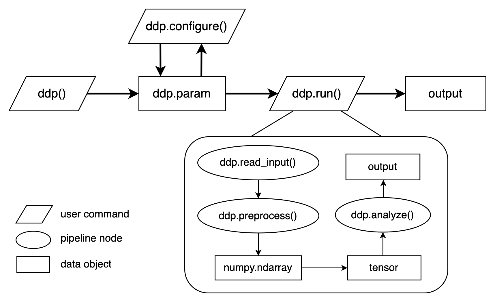

## Dynamic-Neural-Decoding-Pipeline


### Contents
- [Installation](#installation)
- [Usage](#usage)
- [Demos](#demos)
- [Citation](#citation)

### Installation
- #### From source (dependency: CUDA 11.3)
```
# Clone repository
git clone https://github.com/qjin7796/Dynamic-Decoding-Pipeline.git
cd Dynamic-Decoding-Pipeline

# Create a virtual environment
conda create -n ddp_env python=3.10
conda activate ddp_env

# Install pipeline
# See requirements.txt for details
chmod +x setup.sh
./setup.sh
```
- #### Using Docker (dependencies: docker, nvidia-docker2)
```
# Download latest docker image
docker pull ddp/ddp:latest
```

### Usage
#### One-line command
Configure your `ddp_job.py` and run
```
# Locally
python ddp_job.py

# On a cluster
sbatch ddp_job.slurm

# Using docker
ADD /path/to/ddp_job.py /path/to/docker/image
docker run --runtime=nvidia --rm image_id ddp_job.py
```

#### Interactive mode
1. Import modules `from utils import *`
2. Initialize a pipeline `ddp(list_of_analyses=[])`. See [analysis module](docs/AnalysisModule.md) for details.
3. Configure the pipeline `ddp.configure(update_param={})`
4. Execute `ddp.run(monitor=True)`
5. Check output `print(ddp.summary)`

### Demos
- **Stimulus feature pattern computation**
```
python demos/demo_stimulus_feature_pattern.py
```
- **Representational similarity analysis**
```
python demos/demo_rsa.py
```

### Citation